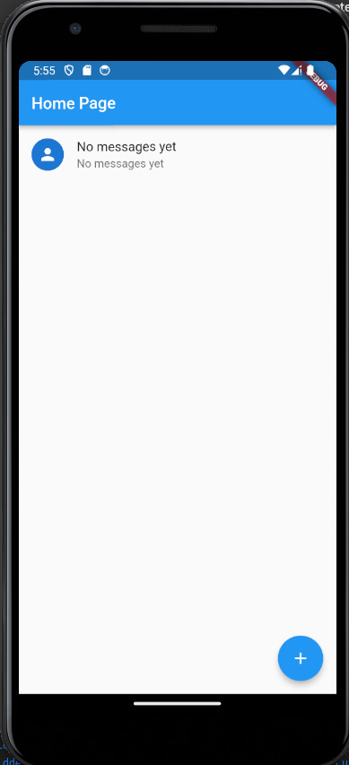
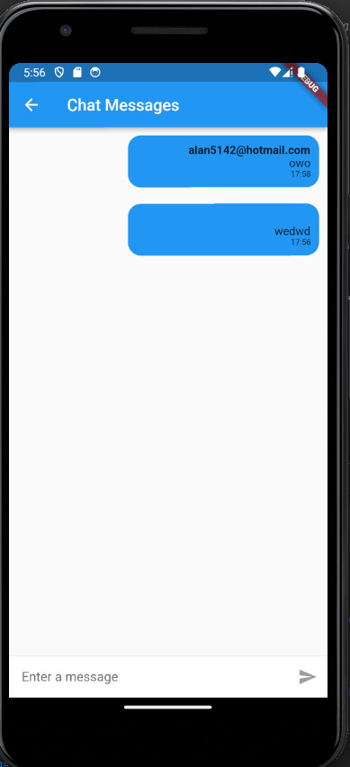
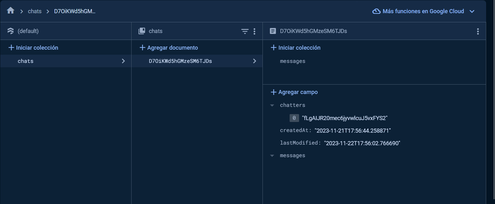
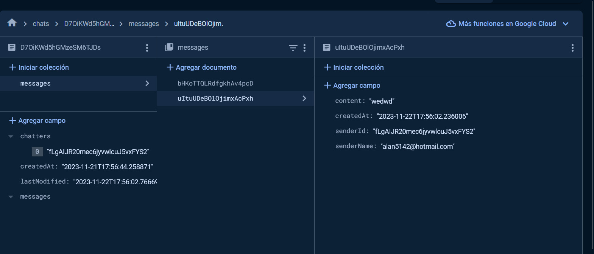

# Tarea 7 - Queries a Firebase

App de chats tipo Whatsapp usando Firestore

## Getting Started

Setup de Flutter y firestore:
https://firebase.flutter.dev/docs/overview/

# Lo que me costo mas trabajo
* Lo mas complicado en esta actividad fue entender como enviar y estructurar los mensajes en flutter para poder enviarlos a Firebase a travez de flutter e igualmente poder reflejar de forma correcta los datos del chat en la aplicacion desde firestore haciendo la diferencia de un mensaje tuyo y el de alguien mas

# Lo que aprendi
* Instancias de Firestore
* Configuracion de Firestore
* Firestore List View

## App Screenshot

